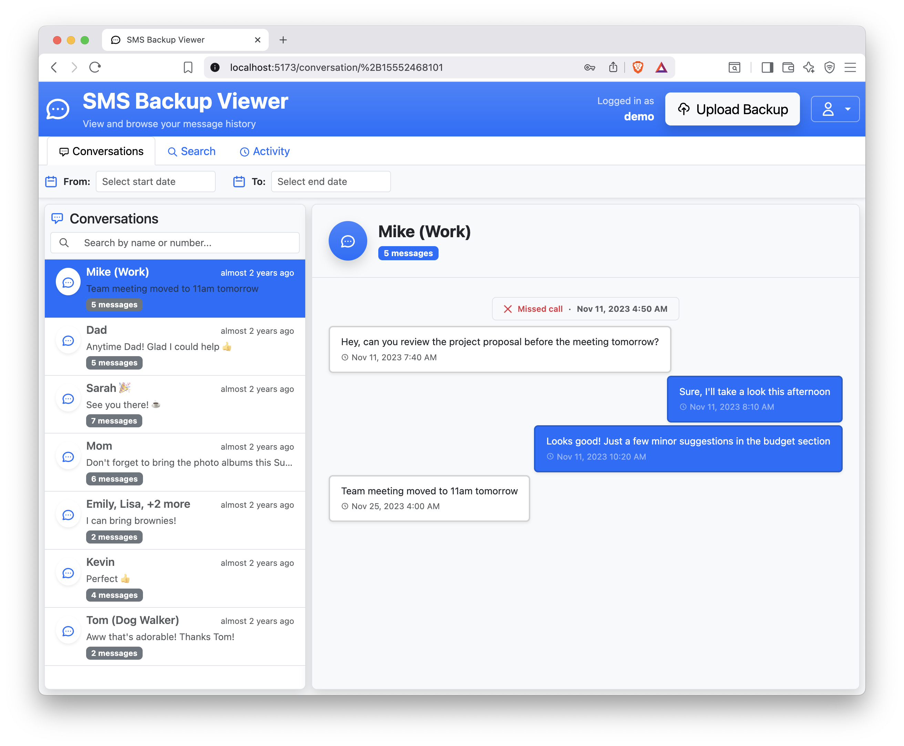
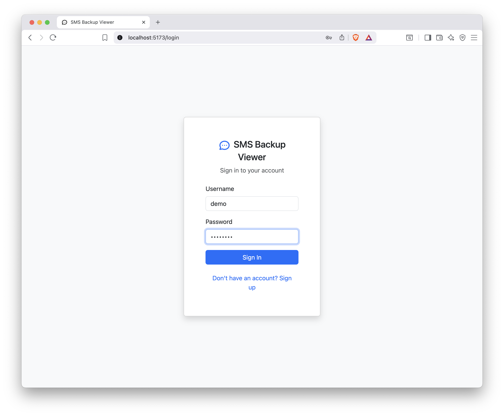
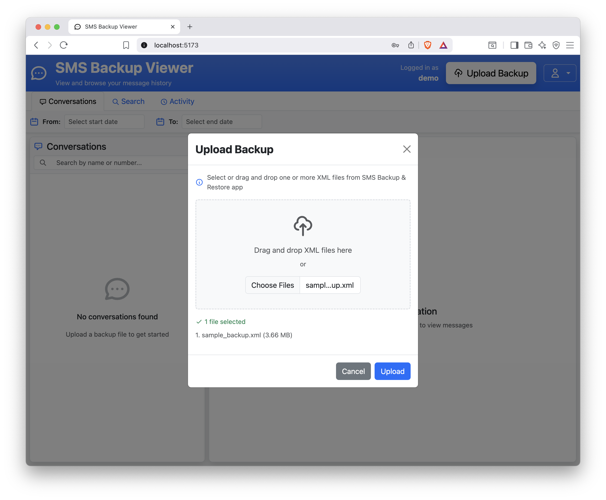
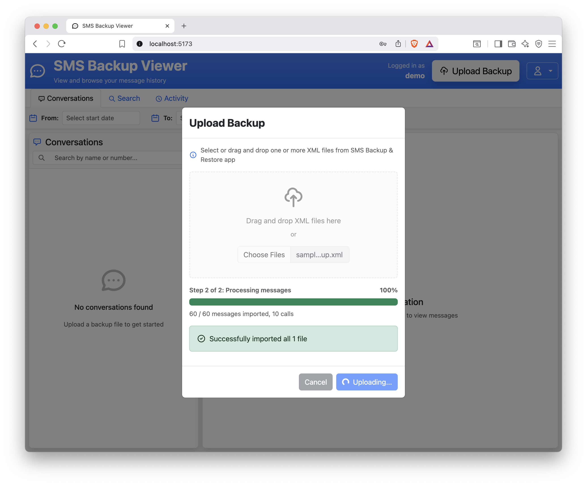
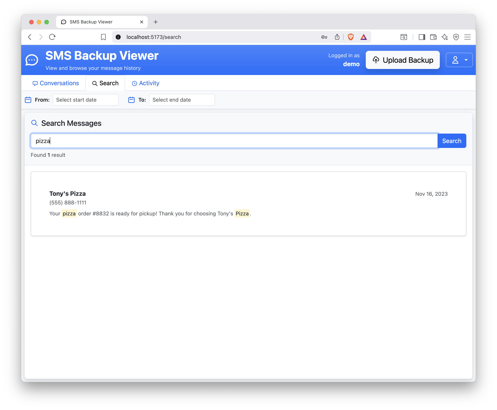
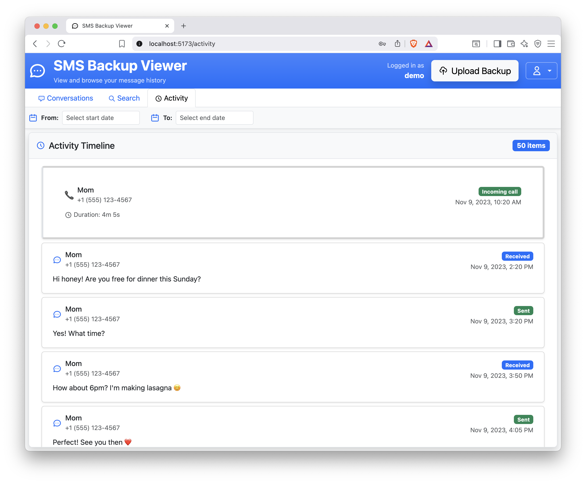
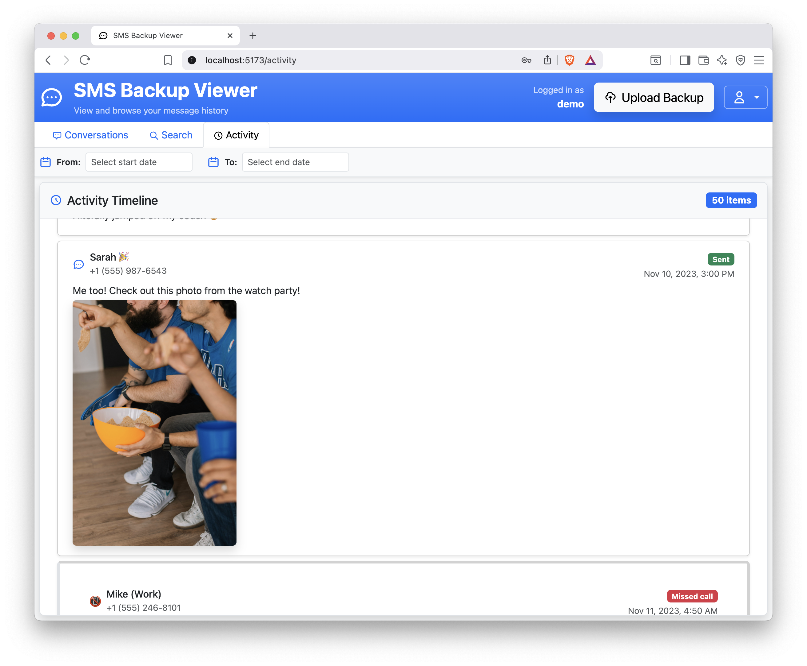

# SMS Backup Viewer (SBV)

A modern web application for viewing SMS and MMS message backups. Import your messages from "SMS Backup & Restore" XML files and browse them in a texting app-like interface.



## Quick Start

### Docker

Run the latest stable version:
```bash
docker run -d \
  -p 8081:8081 \
  -v $(pwd)/data:/data \
  -e PUID=1000 \
  -e PGID=1000 \
  ghcr.io/lowcarbdev/sbv:stable
```

### Docker Compose

```yaml
services:
  sbv:
    image: ghcr.io/lowcarbdev/sbv:stable
    ports:
      - "8081:8081"
    volumes:
      - ./data:/data
    environment:
      - PUID=1000
      - PGID=1000
    restart: unless-stopped
```

## Features

- **Multi-user** - Create a username/password to log in
- **Import SMS Backup & Restore XML** - Upload XML files from the web interface.
- **Idempotent imports** - Upload the same messages without duplicates.
- **Tested with large backups** - Works with multi-GB backups
- **SMS, MMS, and call logs support** - Read all types of call and message records.
- **Inline image and video** - View images or watch videos as you browse. Even works with Apple HEIC and 3gp videos.
- **Fast conversation filtering** - Skip to the right conversation.
- **Full-text search** - Find what you want fast.
- **Activity view** - See it as it happened.
- **vCard preview** - Preview the contents of contact cards (vCards)

## Tech Stack

- **Backend**: Go with SQLite database
- **Frontend**: React with Vite and Bootstrap CSS
- **Database**: SQLite (stores messages, including media as BLOBs)

## Environment Variables

- `PUID` - User ID to run the application as (default: `1000`)
- `PGID` - Group ID to run the application as (default: `1000`)

**Note on PUID/PGID**: Setting these to match your host user ensures that files created in the mounted volume have the desired permissions. Find your UID/GID with `id -u` and `id -g`.

## Data Persistence

The Docker setup uses a bind mount to persist the database:
- Host path: `./data/sbv*.db`
- Container path: `/data/sbv*.db`

This ensures your data survives container restarts and updates.

One sqlite database is created per user.

## License

MIT

## Contributing

- Please submit any issues to github issues
- PRs are welcome, but for anything over ~100 lines, please submit a github discussion first

## Known Issues

- Imports are somewhat slow for large imports on Linux
- In group MMS, the sender label only shows the phone number (not contact name) because the contact name is not available in the XML file

## Screenshots







